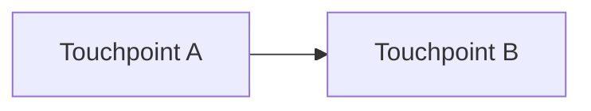

# MR Template Skeleton

Render the filled MR description using this exact structure. Keep section order, heading levels, and the comment placeholders the team's CONTRIBUTING.md expects. Strip the `<!-- TODO -->` blocks once the section is filled.

```markdown
### Description

<one-paragraph summary of what this MR does and why — STE simple words>

<!-- Required: include ONE of mermaid scope diagram OR change-scope table (see references/prose-and-visuals.md) -->

**Change scope:**



<!-- OR when mermaid is a poor fit:

| Area | Change |
|------|--------|
| `<path>` | <short note> |

-->

**Main changes:**

- <bullet 1>
- <bullet 2>
- <bullet 3>

<optional: "**Error code summary:**" table when the diff touches errors/errors.go>

| Code | Status | Change |
|---|---|---|
| `<NAMESPACE>_<CODE>` | <status> | <NEW / `400 → 422` / "now also raised by ..."> |

### Authors

<@handle1>
<@handle2 if any>

### Relevant Tickets

- Closes [<TICKET>](https://jira.example.com/browse/<TICKET>)
- Related [<TICKET>](https://jira.example.com/browse/<TICKET>)   <!-- omit if only one -->

<!-- If no ticket exists: -->
<!-- - [NO-TICKET] <one-line reason> -->

### Checklist

- [ ] If not WIP or draft, run/re-run `static_checks` job to perform checks and assign the MR
- [<x or space>] I have read and followed [CONTRIBUTING.md](../CONTRIBUTING.md)
- [<x or space>] I have updated [CHANGELOG.md](../CHANGELOG.md) under `"## Unreleased"` section
- [<x or space>] My code follows the project's code style and conventions
- [<x or space>] I have performed a self-review of my own code
- [<x or space>] I have added/updated unit tests that prove my fix/feature works
- [<x or space>] All new and existing tests pass locally

### Type of Change

- [<x or space>] 🐛 Bug fix (non-breaking change which fixes an issue)
- [<x or space>] ✨ New feature (non-breaking change which adds functionality)
- [<x or space>] 💥 Breaking change (fix or feature that would cause existing functionality to not work as expected)
- [<x or space>] 🔧 Refactoring (no functional changes, code improvements)
- [<x or space>] 📝 Documentation update
- [<x or space>] ✅ Test additions or updates
- [<x or space>] 🎨 Code style update (formatting, renaming)
- [<x or space>] ⚡ Performance improvement
- [<x or space>] 🔒 Security fix

<!-- When 💥 is ticked, add a quote block under "Type of Change" listing each breaking impact: -->

> **Breaking notes for FE/BFF:**
> - <impact 1>
> - <impact 2>

### Screenshots / Logs / CURL (if applicable)

<!-- For new HTTP behaviour, add curl per flow. Include only the headers/body fields the diff actually requires. -->

```bash
curl -X POST http://<service-host>/<route> \
  -H "Content-Type: application/json" \
  -H "<header>: <value>" \
  -d '<body>'
```

<!-- For new error responses, include the JSON envelope: -->

```json
{
  "status": "error",
  "error": {
    "code": "<NAMESPACE>_<CODE>",
    "message": "<message from errors.go>"
  }
}
```

<!-- Remove this whole section when the change has no observable HTTP/UI surface. -->

### For Reviewers

**Review Guidelines:**

- Focus on functionality, code quality, tests, and documentation
- Be constructive and specific in feedback
- Review within 24-48 hours (urgent MRs: same day)

**Reference:**

- [Contributing Guide](../CONTRIBUTING.md)
```

## Section-by-section rules

| Section | Rule |
|---|---|
| Description | First sentence ≤ 25 words; says **what** and **why**. No commit hashes. |
| Main changes | 3–7 bullets. Each starts with a verb. Reference file paths in backticks when it disambiguates. |
| Error code summary | Include only when `errors/errors.go` (or any namespace `errors/` package) is in the diff. |
| Authors | One `@handle` per line. Read from `git log`, not chat. |
| Relevant Tickets | At most one `Closes`. Other tickets go under `Related`. |
| Checklist | `[x]` only when the diff proves it. Never tick `static_checks`. |
| Type of Change | Tick at least one. Add 💥 in addition to the primary type when applicable. |
| Screenshots / Logs / CURL | Drop the section entirely if the change has no HTTP/UI surface. Don't leave the heading with no body. |
| For Reviewers | Verbatim from CONTRIBUTING.md — do not customize. |
