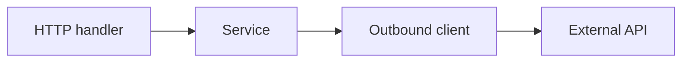

# MR description prose and scope visuals

## STE simple vocabulary

Before `glab mr create` / `gh pr create`, run description markdown through:

1. [`polyglot-copywriter`](../../../engineering/polyglot-copywriter/SKILL.md) — `language: english`, `register: santai`, [simple-prose.md](../../../engineering/polyglot-copywriter/references/simple-prose.md) (short words, active voice, one idea per sentence).
2. [`super-noslop`](../../../engineering/super-noslop/SKILL.md) — **after** mode on the rendered description; drop filler and unearned 💥 claims.

Do not change ticket links, handles, error codes, or checklist syntax.

## Scope diagram (required)

Every MR description must include **at least one** of:

- A **mermaid** diagram (flow, sequence, or component — pick what fits the change), or
- A **table** that maps files/areas to change type (already required when errors change; use a **change scope** table when they do not).

Place the visual in `### Description` after the opening paragraph (see [TEMPLATE.md](../TEMPLATE.md)).

### Example mermaid (feature touching handler + client)

### Example scope table (no error changes)

| Area | Change |
|------|--------|
| `task/foo.go` | New validation |
| `model/foo.go` | Request field |
| `api_test.go` | Table tests |

## Deep review

For GitLab review after the MR is open, use [`glab-code-review`](../../glab-code-review/SKILL.md) instead of Route C boilerplate when the user wants draft inline feedback.
