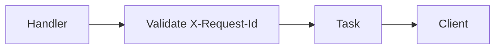

# Sample — description excerpt (diagram + STE)

Use as a shape reference; replace paths and tickets from the branch.

```markdown
### Description

This MR adds header validation on create verification so bad requests fail before we call the downstream service.

**Change scope:**



**Main changes:**

- Reject missing `X-Request-Id` with 422
- Add table tests for empty and malformed values
- Document the header in the runbook snippet
```

Prose was passed through polyglot **simple-prose** + super-noslop before paste.
