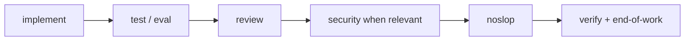

# Workflow gates

Noslop runs **after** implement, test and review (and security when relevant), **before** end-of-work. It is not a substitute for the reviewer or for verification.

| Gate | Where | Noslop relationship |
|------|-------|------------------------|
| Context | `context-harvester` agent, `context-harvesting` rule | Read repo patterns **before** coding (R-37) |
| Verify | A command run **this turn** | R-35 asks for the same bar |
| Review | `reviewer` agent, project review checklist | Catches correctness; noslop catches generic slop |
| Eval / plan | Evals from the plan | A failed eval is fixed before noslop |
| End of work | Your definition of done | Noslop is checked when the diff touches backend, API, messages or comments |

**Auto mode:** apply noslop **during** generation.
