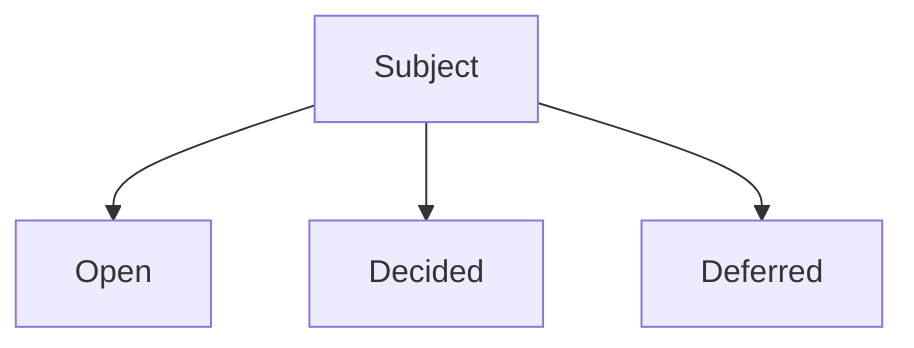

# Mindmap (optional output aid)

Not a diagram skill. Use when the user asks for a mindmap, mermaid, plantuml, or "show the tree" of the grilling so far.

- Sketch **decision nodes**, not a system landscape (that belongs in `super-codebase-learner` or `super-tech-blueprint`).
- Keep it to the current frontier: open vs decided vs deferred.
- Prefer mermaid `flowchart` or `mindmap`; PlantUML only if the repo already uses it.
- One diagram per round is enough. Do not generate a gallery.

If they want C4 or architecture diagrams of the *system*, stop and point at the peer skill that owns that artifact.
